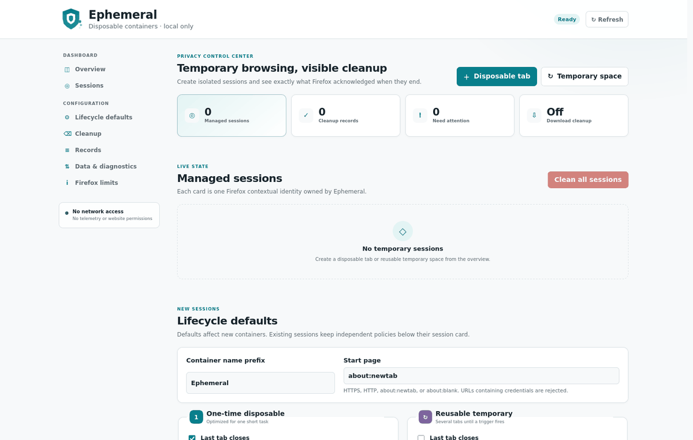

<p align="center"></p>

# Ephemeral

Ephemeral provides temporary Firefox containers for short-lived browsing sessions. Each session is isolated by Firefox and cleaned automatically according to its policy.



## Features

- One-time disposable tabs and reusable temporary spaces
- Independent cleanup on last-tab close, browser restart, inactivity, or manual request
- Concurrent temporary containers
- Automatic recovery after browser or extension restarts
- Clear cleanup status, history, diagnostics, and retry controls
- Settings import and export
- No telemetry, analytics, advertising, tracking, remote logging, or runtime network access

## Install

Firefox 153 or newer is required.

1. Open the [latest release](https://github.com/astarling-x/Ephemeral/releases/latest).
2. Download the file ending in `-signed.xpi`.
3. Open the file in Firefox and approve the requested permissions.

Only the signed XPI is intended for normal installation. ZIP files are provided for source review and reproducible builds.

## Use

1. Select the Ephemeral toolbar button.
2. Choose **Disposable tab** or **Temporary space**.
3. Browse normally inside the new container.
4. End the session by closing its last tab, waiting for its inactivity limit, restarting Firefox, or selecting **Clean now**.
5. Open the dashboard to review active sessions and cleanup results.

The default start page is `about:blank`. A custom HTTP, HTTPS, `about:blank`, or `about:newtab` page can be configured. Firefox's native New Tab page is opened through its supported container-safe path.

## Cleanup scope

Ephemeral requests Firefox to remove the data categories that Firefox can safely target to a container:

| Data                        | Result                                    |
| --------------------------- | ----------------------------------------- |
| Cookies                     | Removed for the container                 |
| IndexedDB                   | Removed for the container                 |
| Local and session storage   | Removed for the container                 |
| Container tabs and identity | Closed and removed                        |
| Download history entries    | Optional; downloaded files remain on disk |
| Ephemeral session state     | Removed after cleanup                     |

Firefox does not expose safe container-scoped removal for browsing history, HTTP cache, Cache Storage, service workers, passwords, permissions, network security state, or downloaded files. Ephemeral never deletes global browser data as a substitute.

## Privacy

Ephemeral stores only settings, managed-container records, recovery state, and bounded cleanup reports on the local device. It does not store browsing URLs, cookie values, page content, or site-storage contents.

The extension has:

- no host permissions;
- no content scripts;
- no runtime dependencies;
- no outbound extension-page connections;
- no private-window access.

See [Privacy](docs/privacy.md) and [Security](SECURITY.md).

## Reliability

- Cleanup is recorded before destructive work begins.
- Work is serialized per container and is safe to retry.
- Failed scoped cleanup keeps the container identity available for recovery.
- Incomplete work is recovered automatically.
- Alarms, retries, history, locks, timers, and in-memory indexes are bounded.
- The background page is non-persistent and event-driven; there is no polling.
- Production builds verify every packaged resource before release.
- Real-Firefox tests verify UI startup, native container tab creation, isolation, storage cleanup, restart recovery, and error handling.

## Development

Requirements: Node.js 20.19+, npm 10+, Python 3.11+, Firefox 153+, and geckodriver.

```sh
npm ci
npm audit --audit-level=high
npm run secrets:audit -- --history
npm run check
npm run coverage
npm run bench
npm run test:e2e:prepare
FIREFOX_BIN=/path/to/firefox npm run test:e2e
npm run package
```

Generated files are written to `artifacts/` and are not committed.

## Documentation

- [Technical design and testing](docs/technical.md)
- [Privacy](docs/privacy.md)
- [Build and release](docs/release.md)
- [Security policy](SECURITY.md)
- [Changelog](CHANGELOG.md)

## License

[MPL-2.0](LICENSE)
